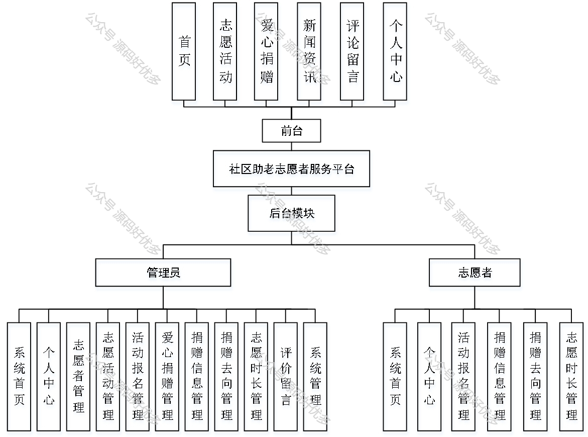

 
## 查看主页获取源码

### 一、作品包含

源码+数据库+设计文档万字+PPT+全套环境和工具资源+部署教程

### 二、项目技术

前端技术：Html、Css、Js、Vue、Element-ui

数据库：MySQL

后端技术：Java、Spring Boot、MyBatis

  

### 三、运行环境

开发工具：IDEA/eclipse

数据库：MySQL5.7

数据库管理工具：Navicat10以上版本

环境配置软件： JDK1.8+Maven3.6.3

前端Nodejs：14

### 四、项目介绍
项目编号：springbootA314

随着我国人口老龄化趋势的加剧，社区中的老年人群体日益庞大，他们对日常生活的帮助和支持需求也日益增长。为了更好地满足这一群体的需求，社区助老志愿者服务平台应运而生。该平台通过整合社区资源，搭建起志愿者与老年人之间的桥梁，同时促进志愿服务的规范化、常态化，营造尊老爱老的社会氛围。

前台用户功能：首页、志愿活动、爱心捐赠、新闻资讯、评论留言和个人中心。

后台分为管理员和志愿者
管理员的功能：系统首页、个人中心、志愿者管理、志愿活动管理、活动报名管理、爱心捐赠管理、捐赠信息管理、捐赠去向管理、志愿时长管理、评价留言、系统管理。
志愿者的功能：系统首页、个人中心、活动报名管理、捐赠信息管理、捐赠去向管理、志愿时长管理。

### 五、运行截图

  
